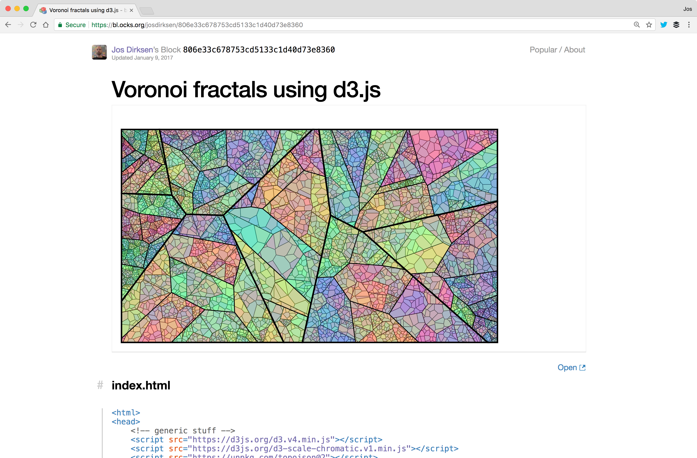

### What is D3?

> D3.js is a JavaScript library for manipulating documents based on data. D3 helps 
> you bring data to life using HTML, **SVG**, and **CSS**. D3’s emphasis on web standards 
> gives you the full capabilities of modern browsers without tying yourself to a 
> **proprietary** framework, combining powerful visualization components and a 
> **data-driven** approach to **DOM manipulation**.

### More info on D3.js

 - Main site: https://d3js.org/
 - API: https://github.com/d3/d3/blob/master/API.md
 - Examples: https://bl.ocks.org/
 
*Usually this will be all you need*

### Bl.ocks.org is great

### Also large number of books

 - Be sure to check version: D3 v4 has new API

*or one of the many others*

### What it is not

 - **Not a charting library**: provides building blocks for other libraries (e.g nvd3.js, Rickshaw.js and c3.js)
 - **Not an SVG abstraction library**: Manipulates the Dom and SVG directly.
 - **Not a Canvas/WebGL library**: Minimal support for Canvas, for 3D use Three.js.
 - **Not a framework**: Can be used with Angular, React, Vue.js and anything else.

### What are we going to cover

- Main patterns:
  - Data binding: **select** / **add** / **update** / **remove**
  - Path generators: such as **arcs** and **path**  
  - Working with **geo** to visualize map based data
  - Add **interactivity**
  - Working with layouts: **force**, **tree** and others 
- Mentions of some other stuff:
  - loading data, working with **Scales**
  - Generative art, transitions

## Follow along

- http://tiny.cc/d3devoxx
- Or last tweet from twitter: **@josdirksen**
